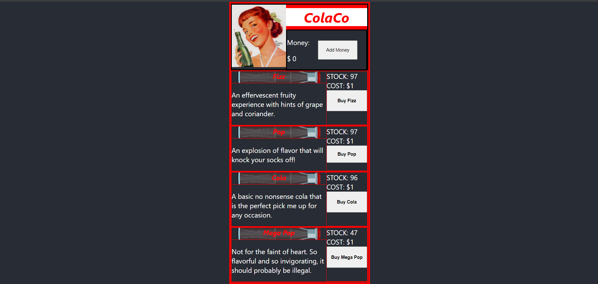

# ColaCo

[](https://choosealicense.com/licenses/mit/)
  
  ## Description
  ColaCo virtual vending machine for their new line of virtual sodas. Users are able to add money to the digital vending machine and purchase a virtual soda. Upon successful purchase users recieve a downloaded JSON file containing their virtual soda.
  
  
  ## Table of Contents
  * [ScreenShot](#ScreenShot)
  * [Installation](#Installation)
  * [MERN TechStack](#mern-techstack)
  * [Server](#Server)
  * [License](#License)
  * [Questions](#Questions)
  
  
  ## ScreenShot
  
  
  
  
  ## Installation
  1. Download or clone the app from github
  2. Install npm packages and dependencies by running: npm install
  4. To seed db run "npm run seed" in the command line
  3. To start the app open app in command line and run "npm start" in the command line

  ## MERN TechStack
  1. MongoDB
  2. Express.js
  3. React
  4. Node.js
  5. Mongoose
  6. Apollo Server
  7. GraphQL

  ## Server
  ### Queries

  The following queres can be used in Insomnia or like application to perform the following server operations

  #### getAllCategories

  GraphQL
  ```GraphQL
  query categories { categories { _id name } }
  ```

  #### getAllProducts

  GraphQL
  ```GraphQL
  query products { products {_id,name,description,price,maximumQuantity,maximumQuantity,category{_id,name}} }
  ```

  #### getProductsByCategory

  GraphQL
  ```GraphQL
  query getProducts($category: ID) {
      products(category: $category) {
        _id
        name
        description
        price
        quantity
        category {
          _id
          name
        }
      }
    }
  ```

  Query Variables
  ```
  {
    "category": "62459f0eda9cf8749fda9475"
  }
  ```

  #### getProductsByName

  GraphQL
  ```GraphQL
  query products ($name: String){ products (name: $name) { _id name description price maximumQuantity quantity category{_id name} } }
  ```

  Query Variables
  ```JSON
  {
    "name": "Fizz"
  }
  ```
  #### addProduct

  GraphQL
  ```GraphQL
  mutation addProduct($name: String!, $description: String!, $price: Float!, $maximumQuantity: Int!, $quantity: Int!, $category: ID!) { addProduct(name: $name, description: $description, price: $price, maximumQuantity: $maximumQuantity, quantity: $quantity, category: $category) {_id,name,description,price,maximumQuantity,maximumQuantity,category{_id,name}}}
  ```

  Query Variables
  ```JSON
  {
    "name": "GrizzCola",
    "description": "Drink the Grizz",
    "price": 1,
    "maximumQuantity": 100,
    "quantity": 100,
    "category": "6243788a85b848b7961d9369"
  }
  ```

  #### updateProduct

  GraphQL
  ```GraphQL
  mutation updateProduct($name: String!, $description: String, $price: Float, $maximumQuantity: Int, $quantity: Int, $category: ID) { updateProduct(name: $name, description: $description, price: $price, maximumQuantity: $maximumQuantity, quantity: $quantity, category: $category) {_id,name,description,price,maximumQuantity,maximumQuantity,category{_id,name}}
  }
  ```

  Query Variables
  ```JSON
  {
    "name": "Fizz",
    "description": "Cola with a Bear kick",
    "price": 2,
    "maximumQuantity": 100,
    "quantity": 100,
    "category": "6243788a85b848b7961d9369"
  }
  ```

  #### deleteProduct

  GraphQL
  ```GraphQL
  mutation deleteProduct($name: String!) { deleteProduct(name: $name) {_id,name,description,price,maximumQuantity,maximumQuantity,category{_id,name}}}
  ```

  Query Variables
  ```JSON
  {
    "name": "Fizz"
  }
  ```
  
  ## License
  Licensed under the [MIT License](https://choosealicense.com/licenses/mit/)
  
  ## Questions
  For questions please reachout
  GitHub: [NukaGrizz](https://github.com/NukaGrizz)
  Email: nukagrizz@gmail.com